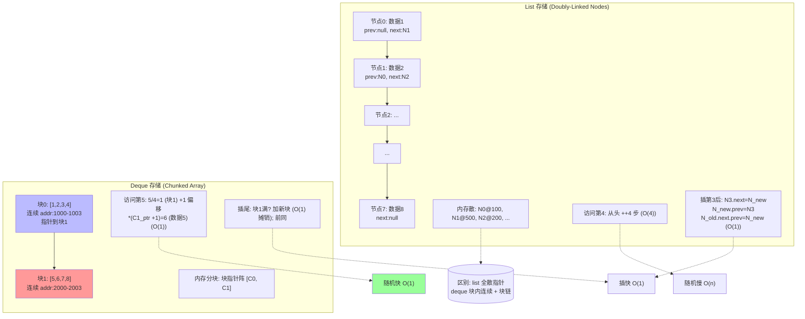

```mermaid
flowchart TD
    subgraph List["List 存储 (Doubly-Linked Nodes)"]
        N0["节点0: 数据1\nprev:null, next:N1"] --> N1["节点1: 数据2\nprev:N0, next:N2"]
        N1 --> N2["节点2: ..."] --> N3[...] --> N7["节点7: 数据8\nnext:null"]
        MemL["内存散: N0@100, N1@500, N2@200, ..."]
        AccessL["访问第4: 从头 ++4 步 (O(4))"]
        InsertL["插第3后: N3.next=N_new\nN_new.prev=N3\nN_old.next.prev=N_new (O(1))"]
    end
    
    subgraph Deque["Deque 存储 (Chunked Array)"]
        C0["块0: [1,2,3,4]\n连续 addr:1000-1003\n指针到块1"] --> C1["块1: [5,6,7,8]\n连续 addr:2000-2003"]
        MemD["内存分块: 块指针阵 [C0, C1]"]
        AccessD["访问第5: 5/4=1 (块1) +1 偏移\n*(C1_ptr +1)=6 (数据5) (O(1))"]
        InsertD["插尾: 块1满? 加新块 (O(1) 摊销); 前同"]
    end
    
    MemL -.-> Diff[("区别: list 全散指针\ndeque 块内连续 + 块链")]
    AccessL -.-> SlowRand["随机慢 O(n)"]
    AccessD -.-> FastRand["随机快 O(1)"]
    InsertL -.-> FastIns["插快 O(1)"]
    InsertD -.-> FastIns
    
    classDef c0 fill:#bbf;
    classDef gap fill:#f99;
    classDef fast fill:#9f9;
    class C0 c0;
    class C1 gap;
    class FastRand fast;
```