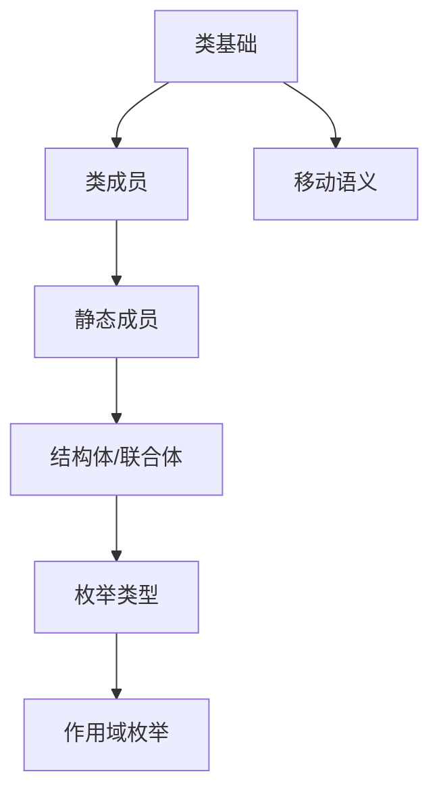
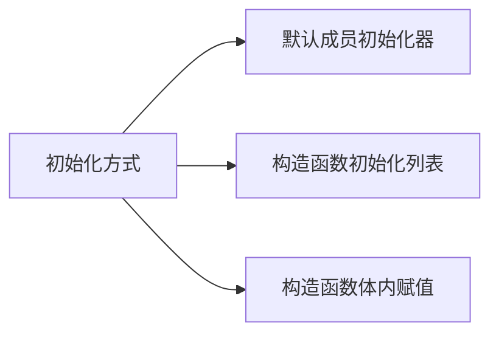
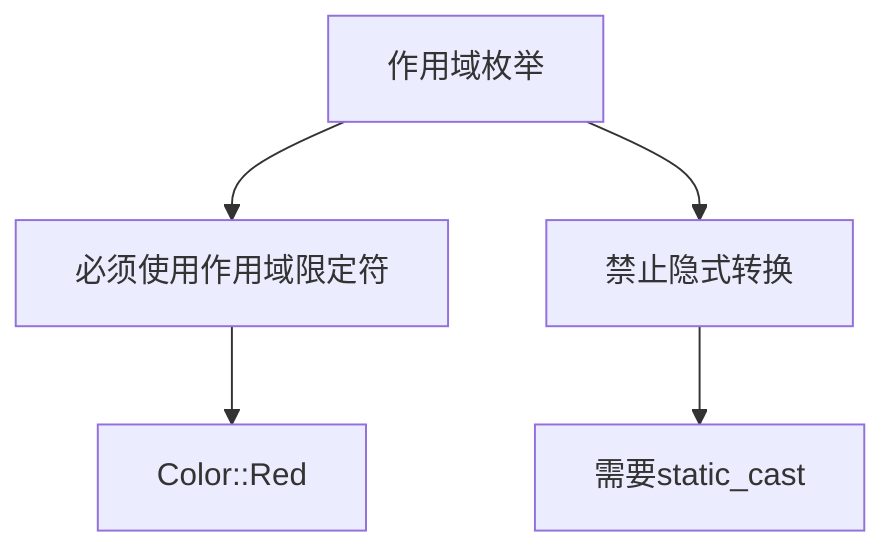

# OOP345 Week 2-3: Classes and Scoped Enumerations | 类与作用域枚举

## 1. 文档基本规范 (Basic Document Standards) 📑
```文件命名
[课程代码]_[Week/Chapter]_[主题].md → OOP345_Week2-3_ClassesEnums.md
```

## 2. 学习路径图 (Learning Path) 🗺️


## 3. 目录 (Table of Contents)
- [类基础](#类基础)  
- [移动语义](#移动语义)  
- [类成员](#类成员)  
- [结构体与联合体](#结构体与联合体)  
- [枚举系统](#枚举系统)  
- [最佳实践](#最佳实践)  

## 4. 知识点详解 (Detailed Content)

### 🟢 类基础 (Class Basics) 
- **定义 | Definition**  
  用户自定义类型，封装数据和相关操作  
  User-defined types encapsulating data and operations

- **关键特性 | Key Features**  
  ```cpp
  class Student {
      // 私有数据成员 | Private data members
      std::string name;  
      int id;
      
  public:
      // 构造函数 | Constructor
      Student(std::string n, int i) : name{n}, id{i} {}
      
      // 成员函数 | Member function
      void display() const {
          std::cout << name << " : " << id;
      }
  };
  ```

### 🟢 数据成员初始化 (Data Member Initialization)


- **默认初始化器 | Default Initializers**
  ```cpp
  class Item {
      int id = ++counter;  // 直接初始化
      const std::string name{"untitled"};
  };
  ```

- **初始化列表 | Initializer List**
  ```cpp
  Item::Item(const char* n) : name{n} {}  // 更高效
  ```

### 🟡 移动语义 (Move Semantics)
- **核心概念 | Core Concept**  
  避免不必要的数据拷贝，提升资源管理效率  
  Avoid unnecessary copying for efficient resource management

- **移动构造函数示例 | Move Constructor Example**:
  ```cpp
  Array(Array&& src) noexcept {
      // 转移资源所有权 | Transfer resource ownership
      a = src.a;
      n = src.n;
      src.a = nullptr;  // 防止重复释放 | Prevent double-free
      src.n = 0;
  }
  ```

### 🔴 拷贝控制 (Copy Control)
```cpp
class Array {
    // 拷贝构造函数
    Array(const Array& src) { /* 深拷贝 */ }
    
    // 拷贝赋值运算符
    Array& operator=(const Array& src) {
        if (this != &src) {
            delete[] a;
            // 分配新内存并拷贝
        }
        return *this;
    }
};
```

### 🟢 类成员 (Class Members)
- **静态成员 | Static Members**
  ```cpp
  class Counter {
      static int count;  // 类级别计数 | Class-level counter
  public:
      Counter() { ++count; }
      static int getCount() { return count; }
  };
  int Counter::count = 0;  // 必须初始化 | Must initialize
  ```

## 5. 结构体与联合体 (Structs and Unions)

### 🟢 差异对比
| 特性 | struct | union |
|------|--------|-------|
| **内存使用** | 独立内存 | 共享内存 |
| **访问控制** | 默认public | 默认public |
| **典型用途** | 数据聚合 | 类型互斥存储 |

### ⚠️ 联合体使用要点
```cpp
union Data {
    int i;
    double d;
    char str[20];
};

// 同时只能使用一个成员
Data data;
data.i = 10;  // ✅ 合法
data.d = 3.14; // ❌ 覆盖之前的值
```

## 6. 枚举系统 (Enumeration System)

### 🟢 枚举核心概念 (Core Concepts)
- **编译时符号 | Compile-time Symbols**
  ```cpp
  enum Flag { Debug = 1, Test = 2, Release = 4 };
  int config = Debug | Test;  // 位运算组合
  ```

- **类型安全实践 | Type Safety**
  ```cpp
  // 普通枚举 - 有风险
  int mode = Debug;  // 隐式转换
  
  // 作用域枚举 - 安全
  enum class Level { Low, Medium, High };
  Level lvl = Level::High;
  // int value = lvl; // 错误！需要static_cast
  ```

### 🟢 普通枚举 vs 作用域枚举
```cpp
// 普通枚举 (全局作用域)
enum Color { Red, Green, Blue };
int color = Green;  // 直接访问

// 作用域枚举 (推荐)
enum class FileMode {
    Read = 0x01,
    Write = 0x02,
    Execute = 0x04
};
FileMode mode = FileMode::Read;
```
### 🟢 作用域枚举访问规范 (Scoped Enum Access Rules)


- **正确访问方式 | Correct Access**:
  ```cpp
  enum class Color { Red, Green, Blue };
  Color c = Color::Red;  // 必须使用作用域限定
  int val = static_cast<int>(Color::Green);  // 需要显式转换
  ```

- **错误模式 | Incorrect Patterns**:
  ```cpp
  Color c = Red;         // 错误：未限定作用域
  int val = Color::Blue; // 错误：隐式转换
  ```

- **设计原理 | Design Rationale**:
  1. 避免命名空间污染
  2. 增强类型安全性
  3. 明确表达设计意图
```

### 🚩 关键差异表
| 特性 | 普通枚举 | 作用域枚举 |
|------|----------|------------|
| 作用域 | 全局 | 类级限定 |
| 隐式转换 | 允许 | 禁止 |
| 类型安全 | 弱 | 强 |
| 防止污染 | 无 | 有 |

## 7. 最佳实践 (Best Practices)
1. **资源管理原则**:
   ```mermaid
   graph LR
       A[构造函数] --> B[分配资源]
       B --> C[析构函数释放]
       C --> D[拷贝控制]
   ```

2. **枚举使用建议**:
   - 优先使用作用域枚举
   - 显式指定底层类型 `enum class : uint8_t {...}`
   - 避免隐式类型转换

## 8. 实践示例 (Practice Examples)

### 🟢 类静态成员应用
```cpp
class BankAccount {
    static double interestRate;  // 类级别利率
public:
    static void setRate(double r) { interestRate = r; }
    // ...
};
double BankAccount::interestRate = 0.03;
```

### 🟡 类型安全联合体
```cpp
struct Product {
    enum IdType { SKU, UPC } id;
    union {
        int skuCode;        // 库存单位编码
        char upc[13];       // 通用产品代码
    } code;
    
    void print() const {
        if (id == SKU) cout << "SKU: " << code.skuCode;
        else cout << "UPC: " << code.upc;
    }
};
```

### 🔴 资源管理类
```cpp
class ResourceHolder {
    int* resource;
    size_t size;
public:
    // 移动构造函数
    ResourceHolder(ResourceHolder&& other) noexcept 
        : resource(other.resource), size(other.size) {
        other.resource = nullptr;
        other.size = 0;
    }
    
    ~ResourceHolder() { delete[] resource; }
};
```

## 9. 学习建议 (Study Tips)
1. **调试技巧**:
   - 使用 `sizeof()` 验证类布局
   - 内存检查工具检测资源泄漏
2. **理解路径**:
   ```基础概念 → 内存模型 → 应用模式```

## 10. 版本记录 (Version Control)
```markdown
更新日期: 2025-09-10  
版本号: v1.0  
更新内容:  
- 新增移动语义详解  
- 添加枚举对比表  
- 补充实践案例
