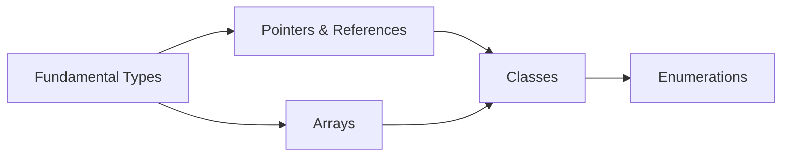

video 22:57 https://teams.microsoft.com/v2/

# OOP345_Week2_CppTypesClasses
> Object-Oriented Programming (OOP345) - Week 2: C++ Types, Classes and Enumerations  
> 面向对象编程 (OOP345) - 第2周：C++类型、类和枚举

## Overview | 概述
This document covers fundamental C++ types, pointers, references, arrays, classes, and enumerations.  
本文涵盖C++基础类型、指针、引用、数组、类和枚举。

## Learning Path | 学习路径 📊


## Table of Contents | 目录
- [1. Fundamental Types](#1-fundamental-types--基础类型) 🧱
- [2. Pointers, References and Arrays](#2-pointers-references-and-arrays--指针引用和数组) 🎯
- [3. Classes and Scoped Enumerations](#3-classes-and-scoped-enumerations--类和范围枚举) 🧩
- [4. FAQ](#4-faq--常见问题) ❓
- [5. Practice Examples](#5-practice-examples--实践示例) 💻
- [6. Study Tips](#6-study-tips--学习建议) 📚

## 1. Fundamental Types | 基础类型

### Integer Types | 整数类型 🟢
- **Definition | 定义**
  - Store whole numbers with signed/unsigned variants  
  存储整数，分为有符号和无符号类型
- **Size Ranges | 大小范围**
  | Type | Min | Max | 类型 | 最小值 | 最大值 |
  |---|---|---|---|---|---|
  | `signed char` | -128 | 127 | `有符号字符` | -128 | 127 |
  | `int` | -2.1e9 | 2.1e9 | `整数` | -21亿 | 21亿 |
  
### Integer Encoding Schemes | 整数编码方案 🟡
- **Two's Complement | 二进制补码**
  - Most common encoding, single zero representation  
  最常见的编码方式，单一零表示
  - Used in modern processors  
  现代处理器使用
  - Example: -5 in 8-bit two's complement: 11111011  
  示例：-5的8位二进制补码表示为 11111011
- **One's Complement | 反码**
  - Two representations of zero (00000000, 11111111)  
  两个零表示（00000000 和 11111111）
  - Example: -5 in 8-bit one's complement: 11111010  
  示例：-5的8位反码表示为 11111010
- **Sign Magnitude | 符号幅度**
  - Most significant bit as sign bit (0=positive, 1=negative)  
  最高位为符号位（0正1负）
  - Two representations of zero (00000000, 10000000)  
  两个零表示
  - Example: -5 in 8-bit sign magnitude: 10000101  
  示例：-5的8位符号幅度表示为 10000101

### Basic Character Set | 基础字符集 🟢
- **96 Characters | 96个字符**
  - Includes: space, control chars (tab, newline), letters, digits, symbols  
  包含：空格、控制字符（制表符、换行符）、字母、数字、符号
  - Full list:  
  完整列表：
    ```
    _ { } [ ] # ( ) < > % : ; . ? * + - / ^ & | ~ ! = , \ " '
    a-z A-Z 0-9
    ```
- **Unicode Support | Unicode支持**
  - `char`: UTF-8 encoding  
  `char`：UTF-8编码
  - `char16_t`: UTF-16 encoding  
  `char16_t`：UTF-16编码
  - `char32_t`: UTF-32 encoding  
  `char32_t`：UTF-32编码
- **Examples | 示例**
  ```cpp
  int decimal = 91;       // 十进制 | Decimal
  int octal = 0133;       // 八进制 | Octal (leading 0)
  int hex = 0x5b;         // 十六进制 | Hexadecimal (leading 0x)
  ```

### Floating-Point Types | 浮点类型 🟢
- **Definition | 定义**
  - Approximate real numbers with varying precision  
  以不同精度存储实数
- **Characteristics | 特性**
  | Type | Size | Digits | Range | 类型 | 大小 | 精度 | 范围 |
  |---|---|---|---|---|---|---|---|
  | `float` | 4B | 6 | -37-38 | `单精度` | 4字节 | 6位 | -37至38次方 |
  | `double` | 8B | 15 | -307-308 | `双精度` | 8字节 | 15位 | -307至308次方 |
- **IEEE 754 Memory Layout | IEEE 754 内存布局**
  - **Two Possible Arrangements | 两种排列方式**
    1. Sign bit - Exponent - Mantissa  
       符号位 - 指数 - 尾数
    2. Sign bit - Mantissa - Exponent  
       符号位 - 尾数 - 指数
  - **Platform Dependency | 平台相关**
    - Implementation defined, affects binary compatibility  
      由实现定义，影响二进制兼容性
- **IEEE 754 Representation | IEEE 754表示法**
  - Sign bit, exponent, and mantissa  
  符号位、指数和尾数
  - Value = (-1)^s × 2^e × (1 + f₁×2⁻¹ + ... + fₙ×2⁻ⁿ)  
  值 = (-1)^s × 2^e × (1 + f₁×2⁻¹ + ... + fₙ×2⁻ⁿ)

### Type Initialization | 类型初始化 🟡
- **Methods | 方法**
  ```cpp
  int a = 7;       // C-style (narrowing risk) | C风格（窄化风险）
  int b {6};       // Direct-list (type-safe) | 直接列表（类型安全）
  ```
- **Practice Tips | 实践提示** 💡
  - Prefer `{}` initialization to prevent narrowing conversions  
  推荐使用`{}`初始化防止窄化转换

### Type Alignment | 类型对齐 🟡
- **alignof()** returns alignment requirement  
  alignof()返回对齐要求
- **alignas()** specifies custom alignment  
  alignas()指定自定义对齐
  ```cpp
  struct alignas(16) B {  // Custom alignment | 自定义对齐
      int n;              // size 4, alignment 4
      char c;             // size 1, alignment 1
  };                      // size 8, alignment 16
  ```

## 2. Pointers, References and Arrays | 指针、引用和数组

### Pointers | 指针 🟡
- **Definition | 定义**
  - Variables storing memory addresses  
  存储内存地址的变量
- **Key Operations | 关键操作**
  ```cpp
  int x = 10;
  int* p = &x;    // Address-of | 取地址
  *p = 20;        // Dereference | 解引用
  ```
- **Hexadecimal Dump Example | 十六进制转储示例**
  ```cpp
  void hexDump(void* a, int n) {
      unsigned char* c = static_cast<unsigned char*>(a);
      // Convert and print each byte in hex | 转换并打印每个字节的十六进制
  }
  ```

### References | 引用 🟡
- **Lvalue References | 左值引用**
  ```cpp
  int x = 10;
  int& ref = x;   // Alias for x | x的别名
  ref = 20;       // Modifies x | 修改x
  ```
- **Rvalue References | 右值引用**
  ```cpp
  int&& rref = 10;  // Binds to temporary | 绑定到临时对象
  ```
- **Standard Library Utilities | 标准库工具**
  - `std::ref()`: Returns lvalue reference | 返回左值引用
  - `std::move()`: Converts to rvalue reference | 转换为右值引用

### Arrays | 数组 🟢
- **Initialization | 初始化**
  ```cpp
  int arr[5] {1, 2, 3};        // Aggregate init | 聚合初始化
  int* dynArr = new int[10];    // Heap allocation | 堆分配
  ```
- **Range-Based For | 范围循环**
  ```cpp
  for (int& e : arr) {  // Reference to modify | 引用可修改
      e *= 2;           // Double elements | 元素加倍
  }
  ```

## 3. Classes and Scoped Enumerations | 类和范围枚举

### Classes | 类 🟡
- **Initialization Methods | 初始化方法**
  1. Default member initializers  
     默认成员初始化器
  2. Member list initializers  
     成员列表初始化器
  ```cpp
  class Item {
      int id = ++count;        // Default initializer | 默认初始化
      const string name;       // Constant member | 常量成员
  public:
      Item(const char* n) : name{n} {}  // Member list | 成员列表
  };
  ```

### Move Semantics | 移动语义 🔴
- **Move Constructor | 移动构造函数**
  ```cpp
  Array(Array&& src) noexcept {  // noexcept for optimization
      a = src.a;                 // Transfer resource
      n = src.n;
      dummy = src.dummy;
      src.a = nullptr;           // Reset source
  }
  ```
- **Move Assignment | 移动赋值**
  ```cpp
  Array& operator=(Array&& src) noexcept {
      if (this != &src) {        // Check self-assignment | 检查自赋值
          delete[] a;            // Release current resources | 释放当前资源
          a = src.a;             // Take ownership | 获取所有权
          n = src.n;
          dummy = src.dummy;
          src.a = nullptr;       // Reset source | 重置源对象
      }
      return *this;
  }
  ```
- **Practice Tips | 实践提示** 💡
  - Use `noexcept` for optimization opportunities  
  使用`noexcept`以获得优化机会
  - Essential for efficient resource management with temporary objects  
  对临时对象的高效资源管理至关重要

### Class Function Constraints | 类函数约束 🟡
- **Static Context Limitations | 静态上下文限制**
  - Cannot access non-static members  
    不能访问非静态成员
  - No `this` pointer available  
    没有可用的`this`指针
  ```cpp
  class Horse {
      static unsigned count;      // Class variable
      unsigned age;               // Instance variable
  public:
      static unsigned howMany() { 
          return count;           // OK - class variable
          // return age;          // ERROR - instance variable
      }
  };
  ```

### Anonymous Classes | 匿名类 🟡
- **Typedef Pattern | Typedef模式**
  ```cpp
  typedef struct {              // Anonymous struct
      unsigned number;
      char desc[41];
  } Course;                     // Typedef name
  ```
- **Practical Applications | 实际应用**
  - Simple data containers  
    简单的数据容器
  - Localized type definitions  
    局部类型定义
  - Avoid namespace pollution  
    避免命名空间污染

### Class Members | 类成员 🟡
- **Class Variables | 类变量**
  - Shared among all instances | 所有实例共享
  ```cpp
  class Horse {
      static unsigned count;  // Declaration | 声明
  };
  unsigned Horse::count = 0;  // Definition | 定义
  ```
- **Class Functions | 类函数**
  - Access class variables | 访问类变量
  ```cpp
  class Horse {
      static unsigned howMany() { return count; }
  };
  ```

### Structs and Unions | 结构体和联合体 🟡
- **Structs**: Members sequential in memory | 成员在内存中顺序排列
- **Unions**: Members share same memory | 成员共享相同内存
  ```cpp
  union Product {
      int sku;
      char upc[13];
  };
  ```

### Enumerations | 枚举 🟡
- **Scoped vs Plain | 范围枚举 vs 普通枚举**
  ```cpp
  enum Color { RED, GREEN };         // Plain (unscoped) | 普通（无作用域）
  enum class Mode { ON, OFF };       // Scoped (type-safe) | 范围（类型安全）
  ```
- **Underlying Types | 底层类型**
  ```cpp
  enum class ErrorCode : uint8_t {   // Specify underlying type
      OK = 0,
      FILE_NOT_FOUND = 1,
      PERMISSION_DENIED = 2
  };
  ```
  - **Benefits | 优点**
    - Control storage size (e.g., `uint8_t` for 1 byte)  
      控制存储大小（例如1字节的`uint8_t`）
    - Improve memory efficiency  
      提高内存效率
    - Ensure binary compatibility  
      确保二进制兼容性
- **Union Tracking | 联合体追踪**
  ```cpp
  enum ProductId { SKU, UPC };       // Enum for union type | 联合体类型枚举
  struct Product {
      ProductId id;                  // Track active member | 追踪活动成员
      union {
          int sku;                   // Integer SKU | 整数SKU
          char upc[13];              // String UPC | 字符串UPC
      } code;
  };
  ```

## 4. FAQ | 常见问题 ❓

**Q1: When to use pointers vs references?**  
何时使用指针 vs 引用？  
⭐ *A: Use pointers when you need reassignment or null values, references for permanent aliases*  
⭐ *答：需要重新赋值或空值时用指针，创建永久别名时用引用*

**Q2: Difference between class and struct?**  
类和结构体有何区别？  
⭐ *A: class has private members by default, struct has public members by default*  
⭐ *答：类默认私有成员，结构体默认公有成员*

**Q3: How to choose between plain and scoped enums?**  
普通枚举和范围枚举如何选择？  
⭐ *A: Prefer scoped enums for type safety and name conflicts prevention*  
⭐ *答：推荐范围枚举以确保类型安全并防止命名冲突*

## 5. Practice Examples | 实践示例 💻

### Type Identification | 类型识别
```cpp
#include <iostream>
#include <typeinfo>

int main() {
    auto x = 5.5f;  // Type inference | 类型推断
    std::cout << "Type: " << typeid(x).name()  // Output: f (float)
              << "\nSize: " << sizeof(x) << " bytes";  // Size: 4 bytes
}
```

### Class Implementation | 类实现
```cpp
#include <iostream>
class Circle {
    float radius;  // Data member | 数据成员
public:
    // Constructor with member initializer | 带成员初始化器的构造函数
    Circle(float r) : radius{r} {}
    
    // Const member function | 常量成员函数
    float area() const { return 3.14159f * radius * radius; }
};

int main() {
    Circle c(5.0f);  // Create instance | 创建实例
    std::cout << "Area: " << c.area();  // Output: 78.5397
}
```

## 6. Study Tips | 学习建议 📚

1. **Memory Visualization**  
   内存可视化
   - Draw diagrams for pointers/references/arrays  
     为指针/引用/数组绘制内存图
   
2. **Type Selection Guide**  
   类型选择指南
   | Use Case | Recommended Type | 用例 | 推荐类型 |
   |---|---|---|---|
   | Whole numbers | `int` or `size_t` | 整数 | `int`或`size_t` |
   | Precise decimals | `double` | 精确小数 | `double` |
   | Resource management | Classes with move semantics | 资源管理 | 带移动语义的类 |

3. **Weekly Review Plan**  
   每周复习计划
   - Day 1: Fundamental types + arrays  
     基础类型 + 数组
   - Day 2: Pointers + references  
     指针 + 引用
   - Day 3: Classes + enumerations  
     类 + 枚举

---
**Version Control**  
版本控制  
- Updated: 2025-09-07  
- Version: 4.1  
- Changes: Added comprehensive details on integer encoding schemes, IEEE 754 memory layout, move constructors, class function constraints, anonymous classes, and enumeration underlying types  
- 更新：2025年9月7日  
- 版本：4.1  
- 变更：添加了整数编码方案、IEEE 754内存布局、移动构造函数、类函数约束、匿名类、枚举底层类型的详细内容

**Changelog | 更新日志**  
**Version 4.1 (2025-09-07)**  
- Added Integer Encoding Schemes section  
  添加整数编码方案部分  
- Expanded IEEE 754 coverage with memory layout options  
  扩展IEEE 754内容，添加内存布局选项  
- Added Move Constructor implementation  
  添加移动构造函数实现  
- Added Class Function Constraints section  
  添加类函数约束部分  
- Added Anonymous Classes pattern  
  添加匿名类模式  
- Added Enumeration Underlying Types explanation  
  添加枚举底层类型说明  
- Improved technical accuracy with bilingual annotations  
  通过双语注释提高技术准确性
