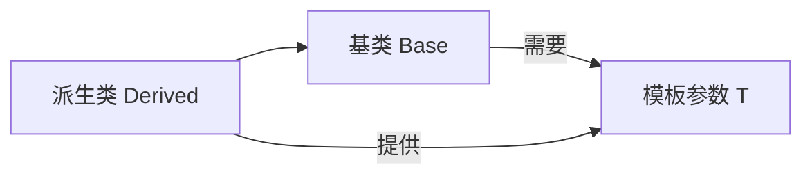
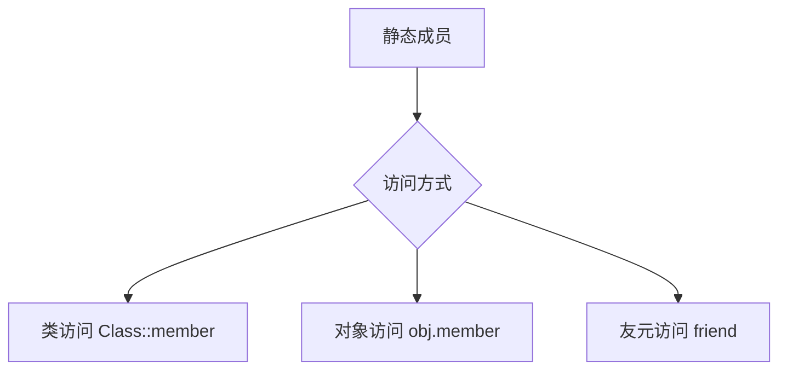

# Class Templates | 类模板 🟡

## Overview | 概述
- Model polymorphic behavior using templates (generics) | 使用模板（泛型）建模多态行为
- Specialize a template for a particular type | 为特定类型特化模板

> "Templates supports generic programming, template metaprogramming, etc. through a combination of features such as integer template arguments, specialization, and uniform treatment of built-in and user-defined types. The result is flexibility, generality, and performance unmatched by 'generics'. The STL is the prime example." - Stroustrup (2014)

## Core Concepts | 核心概念
### Polymorphism Types | 多态类型
- **Ad-hoc polymorphism**: Overloading function names | 函数重载实现
- **Inclusion polymorphism**: Same function signature in inheritance hierarchy | 继承层次中的相同函数签名  
- **Parametric polymorphism**: Using templates (chapter focus) | 通过模板实现（本章重点）

## Template Syntax | 模板语法
### Basic Structure | 基本结构
```cpp
template <template-parameter-list> // 模板头 | Template header
return-type function-name(...) {   // 函数模板 | Function template
    // 模板体 | Template body
}

template <template-parameter-list> // 模板头 | Template header
class Class-name {                 // 类模板 | Class template
    // 模板体 | Template body
};
```

### Template Parameters | 模板参数
#### 1. Type Template Parameter | 类型模板参数 🟢
```cpp
template <typename T>  // 或 template <class T>
```

#### 2. Non-Type Template Parameter | 非类型模板参数 🟡
```cpp
template <int SIZE> // 整型/枚举/指针等 | Integer/enum/pointer/etc
```

#### 3. Template Template Parameter | 模板模板参数 🔴
```cpp
template <template <typename> class Container>
```

## Function Templates | 函数模板
### Basic Example | 基础示例 🟢
```cpp
template <typename T>
void swap(T& a, T& b) {
    T c = a;  // 类型安全交换 | Type-safe swap
    a = b;
    b = c;
}
```

### Specialization | 特化 🟡
```cpp
template <>
const char* maximum<const char*>(const char* a, const char* b) {
    return std::strcmp(a, b) > 0 ? a : b;  // C字符串特殊处理 | Special handling for C-strings
}
```

### Overloading vs Specialization | 重载 vs 特化
- 优先使用重载 | Prefer overloading
- 仅在必要时使用特化 | Use specialization only when required

## Class Templates | 类模板
### Basic Example | 基础示例 🟢
```cpp
template <typename T, int SIZE=50>
class Array {
    T a[SIZE];  // 模板化数组 | Templated array
public:
    T& operator[](unsigned i) { /*...*/ }
};
```

### Static Members | 静态成员 🟡
```cpp
template <typename T>
class Array {
    static unsigned count;  // 声明静态成员 | Declare static member
public:
    // 内联定义静态函数 | Inline static function definition
    static unsigned getCount() { return count; } 
};

template <typename T>
unsigned Array<T>::count = 0;  // 外部初始化 | External initialization
```

💡 **Practice Tips**:
- 静态函数可在类内定义 | Static functions can be defined inside class
- 移除static会破坏类级访问 | Removing static breaks class-level access
- 保持静态以匹配计数器语义 | Keep static to match counter semantics

### Inheritance with Templates | 模板继承 🔴


**关键规则**:
- 派生类必须传递基类所需的所有模板参数 | Derived must pass all template args required by base
- 基类是依赖类型需要具体化 | Base is dependent type requiring concretion

```cpp
// 基类模板 | Base template
template<typename T>
class Base { /*...*/ };

// 派生类模板 | Derived template
template<typename S, typename T>
class Derived : public Base<T> { 
    S extra;  // 派生类特有成员 | Derived-specific member
};
```

## Static Member Deep Dive | 静态成员详解 🟡
### Access Rules | 访问规则


### Design Implications | 设计影响
- **类级计数器**应使用静态函数 | Class counters should use static functions
- **实例级数据**使用非静态成员 | Instance data uses non-static members
- 混合访问导致设计异味 | Hybrid access indicates design smell

## Variadic Templates | 可变参数模板 (OOP345可选) 🔴
```cpp
template <typename... Args>
void print(Args... args) {
    // 使用递归展开参数包 | Use recursion to unpack parameters
}
```

## Best Practices | 最佳实践
1. 默认使用`typename`而非`class`声明类型参数
2. 为常用特化提供默认模板参数
3. 优先选择函数重载而非特化
4. 注意模板实例化可能导致代码膨胀

## Common Pitfalls | 常见问题
1. **静态成员未定义**：忘记外部初始化
2. **模板参数缺失**：派生类未传递基类所需参数
3. **二阶段查找失败**：依赖名称不可见
4. **特化顺序错误**：特化必须在首次使用前声明

## Q&A Summary | 问答摘要
| Question | Solution |
|----------|----------|
| 静态函数必须外定义? | 可内联定义 ([代码示例](#static-members)) |
| 派生类需基类所有参数? | 是，基类是依赖类型 ([图解](#inheritance-with-templates)) |
| static unsigned关系? | static限定符，unsigned返回类型 ([详解](#keyword-analysis)) |

## Exercises | 练习
1. 实现通用`Pair`类模板（🟢）
2. 为`Pair`特化`const char*`版本（🟡）
3. 使用可变参数模板实现`Tuple`（🔴）

## Reference | 参考
- [C++ Templates Wikipedia](https://en.wikipedia.org/wiki/Template_(C%2B%2B))
- 《C++ Templates: The Complete Guide》
